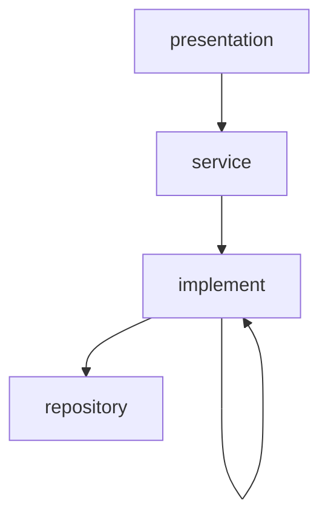
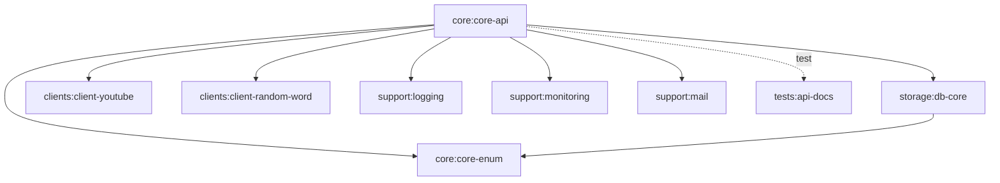

# ARCHITECTURE

[team-dodn/spring-boot-java-template](https://github.com/team-dodn/spring-boot-java-template) 구조를 따르는 멀티 모듈 목표 구조.

## 계층 구조

시스템은 네 개의 계층으로 이루어진다.



| 계층 | 의존 가능한 대상 |
| --- | --- |
| presentation | service |
| service | implement |
| implement | repository, implement |
| repository | 없음 |

### 규칙

- 의존성은 위에서 아래로만 흐른다. 역전은 금지한다.
- 두 계층을 한 번에 뛰어넘는 의존은 금지한다. 바로 아래 계층만 의존한다.
- 같은 계층에 있는 객체를 의존하는 것은 금지한다.
- 단, implement 계층만 같은 계층의 객체를 의존할 수 있다.

## 모듈 구성

```
backend/
├── build.gradle
├── settings.gradle
├── gradle/
│   └── wrapper/
│
├── core/
│   ├── core-enum/
│   └── core-api/
│
├── storage/
│   └── db-core/
│
├── clients/
│   ├── client-youtube/
│   └── client-random-word/
│
├── support/
│   ├── logging/
│   ├── monitoring/
│   └── mail/
│
└── tests/
    └── api-docs/
```

```
include 'core:core-enum'
include 'core:core-api'
include 'storage:db-core'
include 'clients:client-youtube'
include 'clients:client-random-word'
include 'support:logging'
include 'support:monitoring'
include 'support:mail'
include 'tests:api-docs'
```

## 모듈 의존 관계



의존 방향은 `core:core-api` 한쪽으로만 모인다. 아래쪽 모듈은 위쪽 모듈을 알지 못한다.

| 모듈 | 의존하는 모듈 |
| --- | --- |
| `core:core-api` | `core:core-enum`, `storage:db-core`, `clients:*`, `support:*`, (테스트) `tests:api-docs` |
| `storage:db-core` | `core:core-enum` |
| `core:core-enum` | 없음 |
| `clients:client-youtube` | 없음 |
| `clients:client-random-word` | 없음 |
| `support:logging` | 없음 |
| `support:monitoring` | 없음 |
| `support:mail` | 없음 |
| `tests:api-docs` | 없음 |

### 규칙

- `storage:db-core`는 `core:core-api`를 의존하지 않는다. 양방향이 되면 순환이 생기므로, 두 모듈이 함께 쓰는 타입은 `core:core-enum`에만 둔다.
- `core:core-enum`은 어떤 모듈도 의존하지 않는 최하위 모듈이다.
- `clients:*`는 다른 프로젝트 모듈을 의존하지 않고 격리한다. 외부 응답 모델은 각 클라이언트 모듈 안에서 끝내고, 도메인 타입으로의 변환은 `core:core-api`가 맡는다.
- `support:*`는 서로를 의존하지 않는다. 각각 독립적으로 `core:core-api`에만 붙는다.
- `tests:api-docs`는 `core:core-api`의 `testImplementation`으로만 붙는다.

```groovy
// core/core-api/build.gradle
dependencies {
    implementation project(':core:core-enum')
    implementation project(':storage:db-core')
    implementation project(':clients:client-youtube')
    implementation project(':clients:client-random-word')
    implementation project(':support:logging')
    implementation project(':support:monitoring')
    implementation project(':support:mail')

    testImplementation project(':tests:api-docs')
}

// storage/db-core/build.gradle
dependencies {
    implementation project(':core:core-enum')
}
```

## core/core-enum

```
core/core-enum/
└── src/main/java/com/fungame/songquiz/core/enums/
```

## core/core-api

```
core/core-api/
├── src/docs/asciidoc/
├── src/main/java/com/fungame/songquiz/core/
│   ├── api/
│   │   ├── config/
│   │   ├── controller/
│   │   │   └── v1/
│   │   │       ├── request/
│   │   │       └── response/
│   │   └── websocket/
│   ├── domain/
│   │   ├── game/
│   │   │   ├── creator/
│   │   │   ├── event/
│   │   │   └── session/
│   │   ├── room/
│   │   │   └── invite/
│   │   ├── member/
│   │   │   └── auth/
│   │   └── song/
│   └── support/
│       ├── error/
│       ├── response/
│       ├── lock/
│       └── sse/
├── src/main/resources/
└── src/test/java/com/fungame/songquiz/core/
    ├── acceptance/
    ├── api/
    │   ├── controller/
    │   │   └── v1/
    │   └── websocket/
    ├── domain/
    │   ├── game/
    │   ├── room/
    │   ├── member/
    │   └── song/
    └── support/
```

## storage/db-core

```
storage/db-core/
├── src/main/java/com/fungame/songquiz/storage/db/core/
│   ├── config/
│   └── converter/
├── src/main/resources/
│   └── db/
│       ├── local/
│       └── migration/
├── src/test/java/com/fungame/songquiz/storage/db/core/
└── src/test/resources/
```

## clients

```
clients/
├── client-youtube/
│   ├── src/main/java/com/fungame/songquiz/client/youtube/
│   │   └── model/
│   ├── src/main/resources/
│   └── src/test/java/com/fungame/songquiz/client/youtube/
└── client-random-word/
    ├── src/main/java/com/fungame/songquiz/client/randomword/
    │   └── model/
    ├── src/main/resources/
    └── src/test/java/com/fungame/songquiz/client/randomword/
```

## support

```
support/
├── logging/
│   └── src/main/resources/
│       └── logback/
├── monitoring/
│   └── src/main/resources/
└── mail/
    ├── src/main/java/com/fungame/songquiz/support/mail/
    ├── src/main/resources/
    └── src/test/java/com/fungame/songquiz/support/mail/
```

## tests/api-docs

```
tests/api-docs/
└── src/main/java/com/fungame/songquiz/test/api/
```
