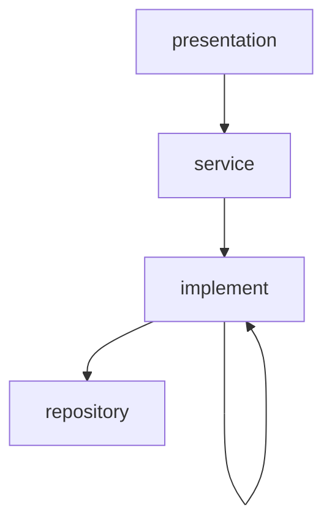
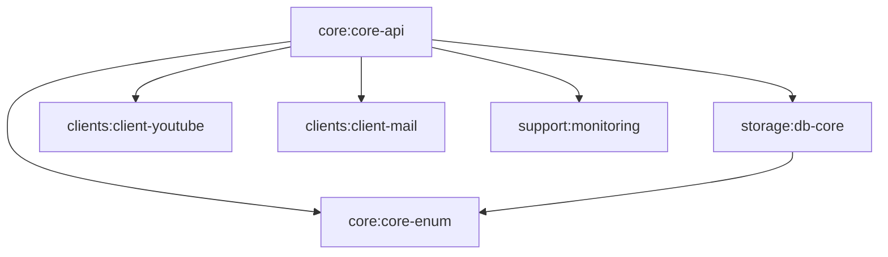

# ARCHITECTURE

[team-dodn/spring-boot-java-template](https://github.com/team-dodn/spring-boot-java-template) 구조를 따르는 멀티 모듈 목표 구조.

## 계층 구조

시스템은 네 개의 계층으로 이루어진다.



| 계층 | 의존 가능한 대상 |
| --- | --- |
| presentation | service |
| service | implement |
| implement | repository, implement |
| repository | 없음 |

### 규칙

- 의존성은 위에서 아래로만 흐른다. 역전은 금지한다.
- 두 계층을 한 번에 뛰어넘는 의존은 금지한다. 바로 아래 계층만 의존한다.
- 같은 계층에 있는 객체를 의존하는 것은 금지한다.
- 단, implement 계층만 같은 계층의 객체를 의존할 수 있다.

계층은 역할 이름이고 패키지 이름과 1:1로 맞아떨어지지 않는다.

| 계층 | 실제 위치 |
| --- | --- |
| presentation | `controller/` |
| service, implement | `domain/<aggregate>/` — Service 와 Reader · Writer 가 한 폴더에 평평하게 있다 |
| repository | `storage:db-core` |

`service → implement` 규율은 폴더로 강제하지 않는다. 기계로 검사하는 것은 `controller → domain` 방향뿐이고(`LayerDependencyTest`), 나머지는 리뷰로 지킨다.

## 모듈 구성

```
backend/
├── build.gradle
├── settings.gradle
├── gradle/
│   └── wrapper/
│
├── core/
│   ├── core-enum/
│   └── core-api/
│
├── storage/
│   └── db-core/
│
├── clients/
│   ├── client-youtube/
│   └── client-mail/
│
├── support/
│   └── monitoring/
```

저장소 루트에 프런트엔드가 함께 있어 gradle 경로는 `backend:` 로 시작한다.

```
include 'backend:core:core-enum'
include 'backend:storage:db-core'
include 'backend:clients:client-youtube'
include 'backend:clients:client-mail'
include 'backend:support:monitoring'
include 'backend:core:core-api'
```

## 모듈 의존 관계



의존 방향은 `core:core-api` 한쪽으로만 모인다. 아래쪽 모듈은 위쪽 모듈을 알지 못한다.

| 모듈 | 의존하는 모듈 |
| --- | --- |
| `core:core-api` | `core:core-enum`, `storage:db-core`, `clients:*`, `support:*` |
| `storage:db-core` | `core:core-enum` |
| `core:core-enum` | 없음 |
| `clients:client-youtube` | 없음 |
| `clients:client-mail` | 없음 |
| `support:monitoring` | 없음 |

### 규칙

- `storage:db-core`는 `core:core-api`를 의존하지 않는다. 양방향이 되면 순환이 생기므로, 두 모듈이 함께 쓰는 타입은 `core:core-enum`에만 둔다.
- `core:core-enum`은 어떤 모듈도 의존하지 않는 최하위 모듈이다.
- `clients:*`는 **외부 서비스를 호출하는 모듈**이다. 다른 프로젝트 모듈을 의존하지 않고 격리한다. 외부 응답 모델은 각 클라이언트 모듈 안에서 끝내고, 도메인 타입으로의 변환은 `core:core-api`가 맡는다.
- `support:*`는 **외부 호출이 없는 횡단 관심사**다(로깅 설정, 모니터링 노출). 서로를 의존하지 않고 각각 독립적으로 `core:core-api`에만 붙는다.
- 메일은 AWS SES 를 호출하므로 `support`가 아니라 `clients:client-mail`이다. `support`에 두면 "외부 호출 없는 횡단 관심사"라는 기준이 깨진다.
- 각 모듈은 자기 설정을 자기 리소스에 갖고, `core:core-api`의 `application.yml`이 `spring.config.import`로 가져간다.

```groovy
// core/core-api/build.gradle
dependencies {
    implementation project(':backend:core:core-enum')
    implementation project(':backend:storage:db-core')
    implementation project(':backend:clients:client-youtube')
    implementation project(':backend:clients:client-mail')
    implementation project(':backend:support:monitoring')
}

// storage/db-core/build.gradle
dependencies {
    implementation project(':backend:core:core-enum')
}
```

## 패키지 루트

모든 모듈이 `com.fungame.songquiz` 를 루트로 쓴다. 템플릿처럼 모듈마다 루트를 나누면 `@SpringBootApplication` 의 컴포넌트 스캔 범위 밖이 되어 각 모듈에 `@Configuration`, `@EnableJpaRepositories`, `@EntityScan` 을 따로 붙여야 한다. 루트를 공유하는 대신 모듈마다 하위 패키지를 하나씩 갖는다.

| 모듈 | 패키지 |
| --- | --- |
| `core:core-api` | `com.fungame.songquiz.{controller, domain, support}` |
| `core:core-enum` | `com.fungame.songquiz.enums` |
| `storage:db-core` | `com.fungame.songquiz.storage` |
| `clients:client-youtube` | `com.fungame.songquiz.client.youtube` |
| `clients:client-mail` | `com.fungame.songquiz.client.mail` |
| `support:monitoring` | `com.fungame.songquiz.support.monitoring` |

## core/core-enum

```
core/core-enum/
└── src/main/java/com/fungame/songquiz/enums/
```

선언할 것이 없어 `build.gradle` 이 없다.

## core/core-api

```
core/core-api/
├── src/docs/asciidoc/
├── src/main/java/com/fungame/songquiz/
│   ├── SongquizApplication.java
│   ├── controller/                presentation
│   │   ├── api/                   REST 컨트롤러
│   │   ├── config/                시큐리티 · 웹 · 웹소켓 · 비동기 설정
│   │   ├── request/               요청 모델
│   │   ├── response/              ApiResponse
│   │   └── websocket/             STOMP 핸들러 · 세션 · 로비 · 초대 알림
│   ├── domain/                    aggregate 하나에 폴더 하나
│   │   ├── member/
│   │   ├── room/
│   │   ├── quiz/
│   │   ├── session/
│   │   └── invite/
│   └── support/                   주인이 없는 횡단 관심사만 남긴다
│       ├── config/                Clock · TaskScheduler 배선
│       └── error/                 CoreException · ErrorType
├── src/main/resources/
└── src/test/java/com/fungame/songquiz/
    ├── acceptance/
    ├── architecture/              ArchUnit 규칙
    ├── controller/
    ├── domain/                    main 과 같은 aggregate 폴더
    └── support/                   테스트 픽스처(MemberFixture, MutableClock)
```

### domain 폴더는 aggregate 단위다

`dto`, `event` 처럼 **타입의 종류**로 나누지 않는다. 그렇게 나누면 한 기능을 고칠 때 폴더 서너 개를 오가게 되고, 이벤트와 결과 타입이 어느 도메인 것인지 폴더만 보고는 알 수 없다. 각 폴더는 그 aggregate 의 개념 · 행동 · 이벤트 · 결과 타입을 모두 갖는다.

| aggregate | 무엇을 책임지나 |
| --- | --- |
| `member` | 회원, 인증, 비밀번호 재설정, 권한 승격, 접속 상태 |
| `room` | 게임방 자체. 설정, 참가자, 입장 · 퇴장 · 준비. **게임 진행은 모른다** |
| `quiz` | 문제와 게임 종류. `Game` 과 구현 3종, 그 재료(`Song`, `ComputerScienceQuiz`, `HangmanWord`) |
| `session` | 한 판의 진행과 점수. `GameSession`, `GameRank`, 라운드 이벤트 |
| `invite` | 방 초대 |

`quiz` 와 `session` 을 나눈 근거는 **서로의 불변식이 없다는 것**이다. 점수가 바뀌어도 문제 상태는 영향을 받지 않고 그 반대도 마찬가지다. `GameSession` 은 두 상태 기계 앞의 파사드일 뿐이고, 정답 판정(`quiz`)과 점수 반영(`session`)은 이미 별도 호출로 분리돼 있다. `room` 이 게임을 모르는 것도 같은 이유다.

## storage/db-core

```
storage/db-core/
├── src/main/java/com/fungame/songquiz/storage/
│   └── converter/
├── src/main/resources/db/
│   ├── migration/                                        V__ 마이그레이션
│   ├── local/                                            R__local_seed.sql
│   ├── manual/                                           손으로 돌리는 보정 스크립트
│   └── vendor/mysql/
└── src/testFixtures/java/com/fungame/songquiz/storage/   IntegrationTest, MySqlTestContainer
```

`src/test` 는 없다. 이 모듈은 통합 테스트 기반만 제공하고 검증은 `core:core-api` 가 한다.

## clients

```
clients/
├── client-youtube/
│   ├── src/main/java/com/fungame/songquiz/client/youtube/
│   └── src/test/java/com/fungame/songquiz/client/youtube/
└── client-mail/
    ├── src/main/java/com/fungame/songquiz/client/mail/
    └── src/main/resources/          client-mail.yml
```

## support

```
support/
└── monitoring/
    ├── src/main/java/com/fungame/songquiz/support/monitoring/
    └── src/main/resources/          monitoring.yml
```

## API 문서

RestDocs 스니펫은 `core:core-api` 의 테스트가 만든다. 별도 모듈로 빼지 않는다.

```
core/core-api/
├── src/docs/asciidoc/index.adoc     스니펫을 조립하는 문서
└── build/generated-snippets/        테스트가 만든 스니펫
```

`bootJar` 가 변환 결과를 `static/docs` 로 넣는다.
