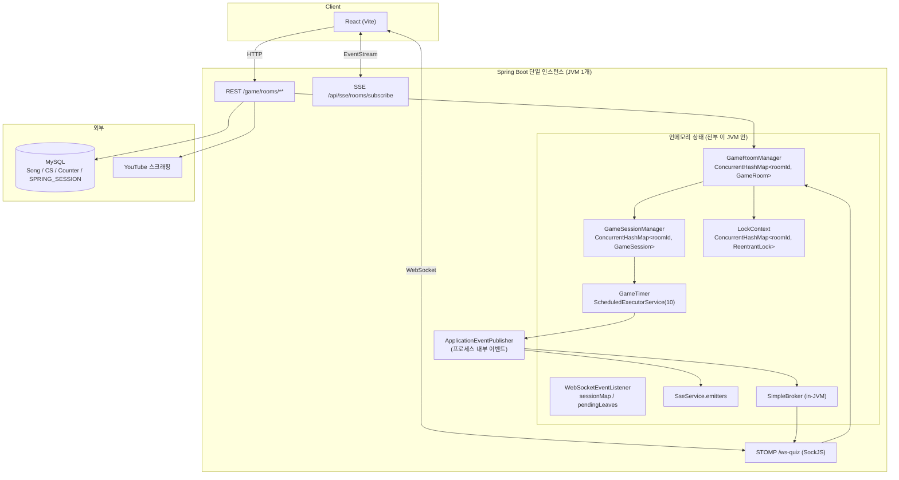
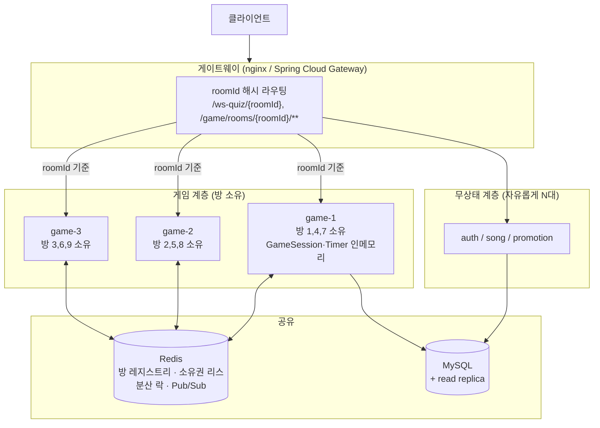

# 백엔드 확장성 설계 (Scalability Design)

작성일: 2026-08-08
대상: `backend` 모듈 (Spring Boot 3.4.3 / Java 21)

---

## 0. 문서의 성격과 전제

`backend/BACKEND.md`에는 **"현재 서버는 1대이며 scale out 할 생각이 전혀 없으니 오버 엔지니어링 금지"** 라는 규칙이 있습니다.
이 문서는 그 규칙을 폐기하자는 제안이 아니라, **"만약 확장을 고려해 설계한다면 어디를 어떻게 바꿔야 하는가"** 에 대한 설계 검토서입니다.

따라서 문서는 세 층으로 나눠서 씁니다.

| 층 | 내용 | 지금 해야 하는가 |
|---|---|---|
| **A. 1대에서도 이미 틀린 것** | 동시성 버그, 튜닝되지 않은 스레드 풀 | **예.** 서버 대수와 무관한 결함 |
| **B. 확장 시 반드시 바뀌어야 하는 것** | 인메모리 상태, JVM 로컬 락, SimpleBroker | 아니오. 단, 지금 구조를 잘 잡아두면 나중이 싸짐 |
| **C. 목표 아키텍처** | 방 소유권 기반 샤딩 | 아니오. 필요해질 때의 설계도 |

**"지금 코드를 고치지 않되, 나중에 고칠 때 다시 쓰지 않도록 경계선만 잘 그어두자"** 가 이 문서의 결론입니다.

---

## 1. 현재 아키텍처



핵심 특징: **게임 진행 상태 전부가 JVM 힙에 있고, 실시간 팬아웃도 JVM 내부 브로커가 담당합니다.**
DB에 있는 것은 `Song`, `ComputerScience`, `Counter`, 그리고 `spring-session-jdbc`의 세션 테이블뿐입니다.

여기서 이미 하나 잘 되어 있는 것이 있습니다: **HTTP 세션이 `spring-session-jdbc`로 DB에 있어서, 인증 세션은 인스턴스를 늘려도 공유됩니다.** 확장 논의에서 보통 제일 먼저 걸리는 지점인데 이건 이미 해결되어 있습니다.

---

## 2. 확장을 막는 지점 (인벤토리)

인스턴스를 2대로 늘리는 순간 무엇이 어떻게 깨지는지, 코드 위치 기준으로 정리합니다.

| # | 위치 | 문제 | 2대에서 나타나는 증상 |
|---|---|---|---|
| 1 | [GameRoomManager.java](backend/core/core-api/src/main/java/com/fungame/songquiz/domain/GameRoomManager.java) `gameRooms` | 방 레지스트리가 인메모리 | A에서 만든 방이 B의 `GET /game/rooms` 목록에 안 보임. B로 붙은 유저는 `GAME_ROOM_NOT_FOUND` |
| 2 | [GameSessionManager.java](backend/core/core-api/src/main/java/com/fungame/songquiz/domain/GameSessionManager.java) `manager` | 게임 세션이 인메모리 | 채팅 정답이 B로 들어오면 세션이 없어서 조용히 무시됨 (`gameSession == null` → return) |
| 3 | [LockContext.java](backend/core/core-api/src/main/java/com/fungame/songquiz/support/lock/LockContext.java) | `ReentrantLock`은 JVM 로컬 | 같은 방에 대한 join/leave/ready가 A와 B에서 동시에 실행되어 상호배제 소멸 |
| 4 | [GameTimer.java](backend/core/core-api/src/main/java/com/fungame/songquiz/domain/GameTimer.java) | 타이머가 로컬 스케줄러 | 게임을 시작한 인스턴스만 라운드를 진행. 그 인스턴스가 죽으면 방이 영원히 멈춤 (복구 경로 없음) |
| 5 | [WebSocketConfig.java](backend/core/core-api/src/main/java/com/fungame/songquiz/controller/config/WebSocketConfig.java) `enableSimpleBroker` | 브로커가 JVM 내부 | A가 `/topic/room/1`로 보낸 메시지가 B에 붙은 구독자에게 **전달되지 않음**. 같은 방인데 화면이 다르게 보임 |
| 6 | [SseService.java](backend/core/core-api/src/main/java/com/fungame/songquiz/support/sse/SseService.java) `emitters` | emitter가 로컬 | 방 목록 `REFRESH`가 같은 인스턴스 구독자에게만 감. 로비 목록이 갱신 안 되는 유저 발생 |
| 7 | [WebSocketEventListener.java](backend/core/core-api/src/main/java/com/fungame/songquiz/controller/websocket/WebSocketEventListener.java) `sessionMap` / `pendingLeaves` | 접속 추적이 로컬 | A에서 끊긴 유저가 B로 재접속하면 A의 pending leave가 취소되지 않아 **재접속 성공 후 5초 뒤 강제 퇴장** |
| 8 | `ApplicationEventPublisher` 전반 | 프로세스 내부 이벤트 | 도메인 이벤트가 인스턴스 경계를 넘지 못함. 5·6번의 근본 원인 |
| 9 | `@Scheduled` 3곳 (`cleanupIdleRooms`, `processPendingUpdate`, `sendHeartbeat`) | 모든 인스턴스에서 각각 실행 | 하트비트 N배 발송, 유휴 방 정리가 각자 로컬 맵만 보고 돌아 일관성 없음 |
| 10 | [GameRoomService.createRoom](backend/core/core-api/src/main/java/com/fungame/songquiz/domain/GameRoomService.java) `counter.increment()` | read-modify-write에 락 없음 | **1대에서도 이미 버그.** 동시 생성 시 lost update로 roomId 중복 → 기존 방 덮어쓰기 |
| 11 | `withSockJS()` | SockJS XHR 폴백은 여러 요청이 같은 인스턴스로 가야 함 | 스티키 세션 없으면 폴백 전송 자체가 실패 |
| 12 | [YoutubeScraper.java](backend/core/core-api/src/main/java/com/fungame/songquiz/support/extern/YoutubeScraper.java) | 캐시 없는 외부 스크래핑 | 인스턴스 수만큼 외부 호출 증가 → 차단/레이트리밋 위험 |

### 2.1 서버 대수와 무관하게 이미 고쳐야 하는 것 (A층)

**(a) roomId 생성의 lost update — #10**

```java
@Transactional
public Long createRoom(...) {
    CounterEntity counter = counterRepository.findByName(GAME_ROOM_COUNTER);
    counter.increment();                          // ← 읽고-더하고-쓰기, 락 없음
    gameRoomManager.createGameRoom(counter.getCount(), ...);
```

두 요청이 동시에 `count=5`를 읽으면 둘 다 `6`을 쓰고, 둘 다 roomId 6으로 방을 만듭니다.
`gameRooms.put(6, ...)` 이 뒤에 실행된 쪽이 앞의 방을 **조용히 덮어씁니다.** 앞 방에 있던 사람들은 다른 게임 방으로 순간이동합니다.

부가 문제: `createGameRoom`(인메모리 쓰기)이 트랜잭션 **안에서** 호출됩니다. 이후 트랜잭션이 롤백되면 DB 카운터는 되돌아가지만 힙의 방은 남습니다. 인메모리 변경은 트랜잭션 밖 또는 커밋 후로 빼는 게 맞습니다.

**(b) 공유 스케줄러 풀 10개 — `AppConfig.scheduledExecutorService()`**

이 풀 하나를 세 곳이 나눠 씁니다.
- `GameTimer`: 방마다 1초 tick
- `WebSocketEventListener`: 접속 종료 유예 타이머
- `WebSocketConfig`: STOMP 하트비트 (10초)

tick 자체는 짧으므로 10 스레드로 방 여러 개는 감당합니다. 문제는 **tick 안에서 동기 작업이 늘어날 때**입니다. `endRound`는 tick 콜백 안에서 인라인으로 실행되고, `@Async`가 안 붙은 이벤트 리스너(`handleGameHint`, `handleGameSkip`, `handleGameResult`)는 발행 스레드에서 그대로 돌아갑니다. 한 방의 라운드 종료 처리가 느려지면 **다른 방의 tick이 밀립니다.** 게임 서버에서 이건 "타이머가 튀는" 체감 버그로 나타납니다.

→ 게임 tick 전용 스케줄러와 하트비트/유예용 스케줄러를 분리하고, 풀 크기를 동시 진행 방 수 기준으로 잡아야 합니다.

**(c) `@EnableAsync` 기본 executor**

[AsyncConfig.java](backend/core/core-api/src/main/java/com/fungame/songquiz/controller/config/AsyncConfig.java)는 executor를 지정하지 않아 Boot 기본값(core 8, **큐 무제한**)을 씁니다. 부하가 올라가면 예외 대신 **브로드캐스트가 조용히 지연**됩니다. 무제한 큐는 장애를 늦게 알려주는 쪽으로 실패합니다. 큐 상한과 거부 정책, 큐 깊이 메트릭이 필요합니다.

**(d) `LockContext`의 락 생애주기**

`deleteLock(roomId)`이 현재 스레드가 그 락을 잡은 상태에서 호출됩니다(`deleteRoom`은 `processWithLockKey` 안에서 불림). 맵에서 사라진 뒤 다른 스레드가 `computeIfAbsent`하면 **다른 락 객체**를 받습니다. 지금은 방이 삭제된 직후라 `getRoom`이 예외를 던져 대체로 무해하지만, 상호배제가 깨지는 구조 자체는 남아 있습니다.

---

## 3. 설계 원칙: 상태를 세 종류로 나눈다

확장 설계의 전부는 "이 상태가 어디에 살아야 하는가"입니다.

| 분류 | 성질 | 저장 위치 | 이 프로젝트의 예 |
|---|---|---|---|
| **무상태 (Stateless)** | 요청 안에서 끝남 | 없음 | 로그인, 노래 등록, 승급 요청, 방 목록 조회 |
| **공유 상태 (Shared)** | 낮은 빈도, 강한 일관성 필요 | DB / Redis | 회원, 노래, CS 퀴즈, HTTP 세션, **방 레지스트리** |
| **소유 상태 (Owned)** | 초당 여러 번 변함, 지연 민감 | **단일 소유 인스턴스의 메모리** | `GameSession`, 라운드 타이머, 점수 집계 |

여기가 이 설계의 갈림길입니다.

**"전부 Redis에 넣는다"는 오답입니다.** 게임 루프는 1초에 한 번 tick하며 상태를 변형하고, 채팅 정답은 그보다 잦습니다. `GameSession`을 매 tick 직렬화/역직렬화하면 왕복 지연과 낙관적 락 재시도가 게임 체감을 망칩니다. 실시간 게임 서버가 관례적으로 **방 단위 소유권(room affinity)** 을 쓰는 이유입니다.

→ **원칙: 방의 권위 있는 상태는 정확히 한 인스턴스의 메모리에 두고, "누가 어느 방을 소유하는가"만 공유한다.**

---

## 4. 목표 아키텍처

### 4.1 A안 — roomId 라우팅 + 방 소유권 (권장)



**작동 방식**

1. 방 생성 시 게이트웨이가 소유 인스턴스를 정하고, Redis에 `room:{id}:owner = instanceId` 를 TTL 리스로 기록합니다.
2. **한 방의 모든 트래픽(WS 구독, 채팅, REST 명령)은 소유 인스턴스로만 라우팅됩니다.** `/ws-quiz` 를 `/ws-quiz/{roomId}` 로 바꾸면 nginx `hash` 나 게이트웨이 predicate로 경로 기반 라우팅이 가능합니다.
3. 소유 인스턴스 안에서는 **현재 코드가 그대로 맞습니다.** `ConcurrentHashMap` + `ReentrantLock` + 로컬 `GameTimer` + `SimpleBroker` 전부 유효합니다.
4. 방 목록과 로비 SSE만 공유가 필요합니다 → Redis에 방 요약 정보를 두고, `RoomChangedEvent`를 Redis Pub/Sub으로 팬아웃합니다.

**장점**
- **기존 게임 도메인 코드를 거의 손대지 않습니다.** 확장 비용이 인프라와 라우팅에 몰리고 도메인은 보존됩니다.
- tick 지연이 늘지 않습니다 (상태가 여전히 로컬 메모리).
- STOMP 외부 브로커(RabbitMQ 등)가 필요 없습니다 — 한 방의 구독자가 모두 같은 인스턴스에 있으니까요.

**단점 / 감수할 것**
- 소유 인스턴스가 죽으면 **그 방의 진행 중 게임은 유실됩니다.** 완화책: 라운드 경계마다 Redis에 체크포인트를 남기고, 새 소유자가 라운드 시작 지점부터 복구. "라운드 중간 정밀 복구"는 비용 대비 가치가 낮아 포기하는 쪽을 권합니다.
- 배포 시 드레인이 필요합니다 (§7).
- 방마다 부하가 달라 핫스팟이 생길 수 있습니다 → 단순 해시 대신 **활성 방 수 기준 최소 부하 할당**을 씁니다.

### 4.2 B안 — 완전 공유 상태

`GameRoom`/`GameSession`을 Redis에, 락은 Redisson, STOMP는 RabbitMQ 브로커 릴레이. 인스턴스는 완전히 대체 가능해집니다.

**장점**: 어느 인스턴스가 죽어도 게임이 이어짐, 라우팅 불필요, 스티키 세션 불필요.
**단점**: 게임 도메인 전체를 다시 씁니다. `GameSession`은 현재 `Game` 객체 그래프를 직접 변형하는 설계라 직렬화 경계가 없습니다. tick마다 Redis 왕복이 붙고, 동시 변형(채팅 정답 + 타이머 만료)에 낙관적 락 재시도가 필요해집니다. `startProcessing()`으로 처리하던 라운드 중복 종료 방지도 분산 CAS로 바꿔야 합니다.

### 4.3 선택

**A안을 권장합니다.**

이 서비스의 방은 수명이 짧습니다 (유휴 30분 정리, 게임 한 판은 몇 분). 인스턴스 장애 시 **"진행 중 한 판을 잃는 것"의 비용이 낮습니다** — 유저는 방을 다시 만들면 됩니다. 반면 B안이 요구하는 도메인 재작성 비용은 매우 높습니다. 가용성 요구가 이 정도일 때 A안이 명백히 유리합니다.

B안이 정당해지는 조건: 랭크 게임처럼 한 판의 결과가 영속적 가치를 가질 때, 또는 무중단 배포 중에도 진행 중 게임이 끊기면 안 될 때.

---

## 5. 컴포넌트별 재설계 (A안 기준)

지금 당장 구현하라는 뜻이 아니라, **"확장할 때 이 인터페이스로 갈린다"** 는 경계선입니다.

### 5.1 방 레지스트리 — 로컬 맵을 인터페이스 뒤로

가장 값싸고 효과가 큰 준비 작업입니다. 지금 구현을 그대로 두고 인터페이스만 뽑습니다.

```java
public interface RoomRegistry {
    void register(Long roomId, RoomSummary summary);   // 로비 목록용 요약
    Optional<RoomSummary> find(Long roomId);
    List<RoomSummary> findAll();
    void unregister(Long roomId);
}

// 지금: LocalRoomRegistry (ConcurrentHashMap) — 동작 동일, 리스크 0
// 확장 시: RedisRoomRegistry (Hash + TTL) 로 교체, 도메인 코드 무변경
```

핵심은 **로비 목록에 필요한 `RoomSummary`(제목, 인원, 상태, 게임 타입)와 게임 진행에 필요한 `GameRoom`을 분리**하는 것입니다. 전자만 공유하면 되고, 후자는 소유 인스턴스에 남습니다. 현재 `RoomInfo.from(...)`이 이미 그 요약을 만들고 있으니 개념은 있는 셈입니다.

### 5.2 방 소유권

```java
public interface RoomOwnership {
    boolean acquire(Long roomId);        // 리스 획득 (TTL, 예: 30초)
    void renew(Long roomId);             // 하트비트로 갱신
    void release(Long roomId);
    Optional<String> ownerOf(Long roomId);
}
```

- Redis `SET room:{id}:owner {instanceId} NX EX 30` + 주기적 갱신.
- 소유자가 죽으면 TTL 만료 → 다른 인스턴스가 인수하고 **로비 목록에서 방을 제거**합니다 (진행 중 게임은 포기).
- 요청이 비소유 인스턴스에 도달하면 소유자로 리다이렉트하거나 명확한 오류를 반환합니다. 조용히 로컬에서 처리하는 것이 최악입니다 — 지금 코드의 `gameSession == null → return`이 정확히 그 실패 모드입니다.

### 5.3 락

`LockContext`의 시그니처(`processWithLockKey(key, supplier)`)는 이미 좋습니다. 이 인터페이스는 로컬/분산 양쪽으로 구현 가능합니다.

```java
public interface RoomLock {
    <T> T withLock(Long roomId, Supplier<T> action);
}
// LocalRoomLock: ReentrantLock (현재)
// RedissonRoomLock: RLock, waitTime/leaseTime 명시
```

A안에서는 방 소유권이 이미 상호배제를 보장하므로 **분산 락이 필요 없습니다.** 필요한 곳은 방 생성/삭제/소유권 인수 같은 크로스 인스턴스 경합 지점뿐입니다. 이게 A안의 큰 이점입니다.

`deleteLock`은 락 해제 이후로 미루도록 고쳐야 합니다 (§2.1-d).

### 5.4 roomId 생성

카운터 테이블의 read-modify-write를 버립니다.

- **1순위**: 전용 테이블의 `AUTO_INCREMENT` 또는 DB 시퀀스. 원자적이고 인스턴스 수와 무관합니다.
- **2순위**: 지금 테이블을 유지해야 하면 `UPDATE counter SET count = count + 1 WHERE name = ?` 후 재조회 — 원자적 UPDATE로 lost update가 사라집니다.
- Redis `INCR`도 가능하지만, 이미 있는 DB로 충분한데 의존성을 늘릴 이유가 없습니다.

인메모리 방 생성은 트랜잭션 커밋 이후로 옮깁니다.

### 5.5 실시간 팬아웃

| 채널 | A안에서의 처리 |
|---|---|
| **방 내부 STOMP** (`/topic/room/{id}`) | 소유 인스턴스에 구독자가 모여 있으므로 **SimpleBroker 유지**. 외부 브로커 불필요 |
| **로비 SSE** (`RoomChangedEvent`) | Redis Pub/Sub → 각 인스턴스가 자기 emitter에게 팬아웃 |
| **글로벌 공지** (있다면) | Redis Pub/Sub 동일 |

이벤트 발행 지점을 추상화해 두면 좋습니다.

```java
public interface RoomEventBroadcaster {
    void broadcast(RoomChangedEvent event);   // 로컬: ApplicationEventPublisher
                                              // 확장: Redis Pub/Sub → 각 노드
}
```

### 5.6 스케줄러 중복 실행

`@Scheduled` 3곳을 분류합니다.

| 작업 | 성질 | 확장 시 처리 |
|---|---|---|
| `SseService.sendHeartbeat` | **인스턴스 로컬** — 자기 emitter만 대상 | 모든 인스턴스에서 실행. 그대로 둠 |
| `SseService.processPendingUpdate` | **인스턴스 로컬** — 자기 emitter만 대상 | 그대로 둠 |
| `GameRoomManager.cleanupIdleRooms` | **소유한 방만** 대상이어야 함 | 소유권 필터 추가. 리더 선출 불필요 |

세 개 모두 리더 선출이 필요 없습니다. 다만 **"이 스케줄 작업이 로컬 대상인지 전역 대상인지"** 를 코드에 주석이나 네이밍으로 남겨두는 게 나중에 큰 차이를 만듭니다. 전역 작업(정산, 집계 등)이 추가되면 ShedLock 같은 걸 붙이면 됩니다.

### 5.7 접속 유예 처리

`pendingLeaves`가 로컬이라 A→B 재접속 시 오탐 퇴장이 발생합니다(#7). A안에서는 **한 방의 모든 연결이 같은 인스턴스로 라우팅되므로 이 문제가 자연히 사라집니다.**

다만 현재 유예가 5초(`LEAVE_GRACE_SECONDS = 5`)인데 `SERVER_REQUIREMENTS.md`는 30초를 요구합니다. 스케일아웃과 무관한 별개 항목이니 같이 정리하면 좋겠습니다.

### 5.8 데이터 계층

- **읽기 편중**: 노래/CS 퀴즈는 읽기 위주에 변경이 드묾 → 애플리케이션 캐시(Caffeine)가 가장 값싼 해법. 읽기 레플리카는 그 다음.
- **`YoutubeScraper`**: 스크래핑 결과를 DB나 캐시에 저장해 재사용. 인스턴스가 늘면 외부 호출도 배로 늘어 차단 위험이 커집니다. 타임아웃과 서킷 브레이커도 필요합니다 (현재 외부 호출이 요청 스레드를 잡습니다).
- **`spring-session-jdbc`**: 이미 공유됨. 다만 매 요청 DB 조회가 붙으니 트래픽이 커지면 Redis 세션이 유리합니다.

---

## 6. 그래서 지금 무엇을 하는가 (로드맵)

각 단계는 **독립적으로 가치가 있고**, 다음 단계로 안 넘어가도 손해가 없게 구성했습니다.

### 0단계 — 1대에서의 결함 수정 (권장: 지금)

확장과 무관하게 지금 틀린 것들입니다.

- [ ] `roomId` 생성을 원자적으로 (§5.4) — **방 덮어쓰기 버그 제거**
- [ ] 인메모리 방 생성을 트랜잭션 밖으로
- [ ] 스케줄러 풀 분리: 게임 tick 전용 vs 하트비트/유예 (§2.1-b)
- [ ] `@Async` executor 명시 — 큐 상한, 거부 정책, 메트릭 (§2.1-c)
- [ ] `deleteLock` 을 락 해제 후로 (§2.1-d)
- [ ] 유예 시간 5초 → 요구사항대로 조정 (§5.7)

**종료 조건**: 동시 방 생성 부하 테스트에서 roomId 중복 0건. 활성 방 20개에서 tick 지연 p99 < 200ms.

### 1단계 — 관측 가능성 (권장: 지금)

**측정 없이는 확장이 필요한지조차 알 수 없습니다.** 이 단계가 0단계와 함께 실질적인 "지금 할 일"입니다.

- [ ] Actuator + Micrometer, 메트릭: 활성 방 수, WS 연결 수, tick 지연 분포, `@Async` 큐 깊이, SSE emitter 수
- [ ] 게임 루프 예외 로깅 — 현재 `scheduleAtFixedRate` 콜백에서 예외가 나면 **해당 방의 타이머가 조용히 영구 정지**합니다. tick 내부를 try/catch로 감싸고 에러를 기록해야 합니다
- [ ] JVM 힙/스레드 대시보드

**종료 조건**: "인스턴스 1대의 한계가 방 N개 / 동접 M명"이라고 숫자로 답할 수 있음.

### 2단계 — 경계선 긋기 (저비용, 확장 대비)

동작을 바꾸지 않고 인터페이스만 도입합니다. 리스크가 거의 없고, 나중 비용을 크게 줄입니다.

- [ ] `RoomRegistry` 인터페이스 + `LocalRoomRegistry` (§5.1)
- [ ] `RoomSummary`(로비용)와 `GameRoom`(진행용) 분리
- [ ] `RoomLock` 인터페이스 (§5.3)
- [ ] `RoomEventBroadcaster` 인터페이스 (§5.5)
- [ ] `@Scheduled` 각 작업에 "로컬 대상 / 전역 대상" 명시

**종료 조건**: 기존 테스트 전부 통과. 런타임 동작 변화 0.

### 3단계 — 실제 스케일아웃 (1단계 지표가 한계를 보일 때만)

- [ ] Redis 도입: `RedisRoomRegistry`, `RoomOwnership`, Pub/Sub
- [ ] 게이트웨이에 roomId 라우팅, `/ws-quiz` → `/ws-quiz/{roomId}`
- [ ] 소유권 리스 + 하트비트 + 인수 시 방 제거
- [ ] 드레인 가능한 배포 (§7)

**진입 조건 (이게 중요)**: 1단계 지표가 실제 한계에 닿았을 때. **"곧 유저가 늘 것 같다"는 느낌은 진입 조건이 아닙니다.**

**스케일아웃보다 먼저 시도할 것**: 인스턴스 스펙 상향과 스레드 풀 튜닝. §2.1-b에서 본 것처럼 **현재 첫 한계는 스레드 풀 10개일 가능성이 높고, 그건 설정 한 줄입니다.** 서버를 늘리는 것보다 압도적으로 쌉니다.

---

## 7. 배포와 운영 (3단계 이후)

**드레인**
1. 인스턴스를 "신규 방 배정 제외"로 표시 (Redis 플래그)
2. 소유한 방들이 자연 종료되기를 대기 (게임 한 판 ≈ 수 분)
3. 남은 방에 종료 예고 브로드캐스트 후 정리
4. 종료

Kubernetes라면 `preStop` 훅 + 넉넉한 `terminationGracePeriodSeconds`, 그리고 **롤링 업데이트를 방 수명보다 느리게** 설정합니다.

**헬스체크 분리**
- `/actuator/health/liveness`: JVM 생존
- `/actuator/health/readiness`: 신규 방을 받을 수 있는가 (드레인 중이면 false)

두 개를 합치면 드레인 중 인스턴스가 재시작되어 진행 중 게임이 죽습니다.

**세션 어피니티**: SockJS XHR 폴백 때문에 3단계에서도 스티키가 필요합니다(#11). roomId 경로 라우팅을 쓰면 자연히 만족됩니다.

---

## 8. 하지 않을 것 (명시적 배제)

오버 엔지니어링 금지 규칙을 지키기 위해, **검토했지만 이 서비스에는 부적합**한 것들을 남깁니다.

| 항목 | 배제 이유 |
|---|---|
| **마이크로서비스 분해** | 도메인이 작고 팀이 작습니다. 모듈 경계는 패키지로 충분합니다 |
| **Kafka 이벤트 소싱** | 방 수명이 짧고 이벤트 재생 가치가 없습니다 |
| **CQRS + 별도 읽기 모델** | 로비 목록은 방 몇 개 순회로 끝납니다 |
| **`GameSession` 전면 Redis 이관 (B안)** | tick 지연 증가와 도메인 재작성 비용이 이득을 초과합니다 (§4.2) |
| **STOMP 외부 브로커 (RabbitMQ)** | A안에서는 방 구독자가 한 인스턴스에 모여 불필요합니다 |
| **`@Scheduled` 리더 선출 (ShedLock)** | 현재 스케줄 작업 3개 모두 로컬 대상입니다 (§5.6) |
| **멀티 리전** | 대상 사용자가 국내이고 지연 이득이 없습니다 |

---

## 9. 검증 전략

`BACKEND.md`의 TDD 원칙에 맞춰, 각 단계를 어떻게 검증하는지 정리합니다.

**0단계**
- roomId 원자성: 동시 `createRoom` N개 실행 후 반환 ID의 유일성 단정 (스텁 리포지토리 대신 실 DB 통합 테스트가 필요합니다 — lost update는 DB 격리 수준에서 발생하므로)
- tick 격리: 한 방의 라운드 종료를 인위적으로 지연시키고 다른 방의 tick 간격을 `awaitility`로 측정 (이미 의존성에 있습니다)

**2단계**
- `RoomRegistry` 계약 테스트를 작성하고 `Local`/`Redis` 구현이 동일하게 통과하도록 — 3단계 교체 시 안전망이 됩니다

**3단계**
- 인스턴스 2개를 띄우는 통합 테스트 (Testcontainers Redis): A에서 만든 방이 B의 목록에 보이는지, 비소유 인스턴스 요청이 **조용히 무시되지 않고** 명확히 처리되는지
- 소유자 강제 종료 후 방이 로비에서 사라지고 유저가 명확한 안내를 받는지

---

## 10. 요약

- **지금 코드는 단일 인스턴스 전제로 일관되게 작성되어 있고, 그 전제 안에서는 합리적입니다.** 인메모리 맵 + JVM 락 + SimpleBroker는 1대에서 가장 빠르고 단순한 선택입니다.
- **확장을 막는 것은 12개 지점이며, 그중 진짜 어려운 것은 브로커(#5)와 게임 세션 소유(#2, #4)입니다.**
- **`roomId` 생성의 lost update(#10)는 서버 대수와 무관하게 지금 존재하는 버그**이고, 방을 덮어쓰는 사용자 체감 장애를 일으킬 수 있습니다.
- **권장 목표는 A안(방 소유권 + roomId 라우팅)** 입니다. 게임 도메인 코드를 보존하면서 확장하는 경로이고, 짧은 방 수명이라는 이 서비스의 특성과 잘 맞습니다.
- **지금 할 일은 0·1·2단계** — 결함 수정, 관측, 경계선 긋기. 세 개 다 확장 없이도 그 자체로 이득이고, `BACKEND.md`의 오버 엔지니어링 금지와 충돌하지 않습니다.
- **3단계는 1단계 지표가 한계를 증명한 뒤에만** 착수하고, 그 전에 스레드 풀 튜닝과 스펙 상향을 먼저 시도합니다.
