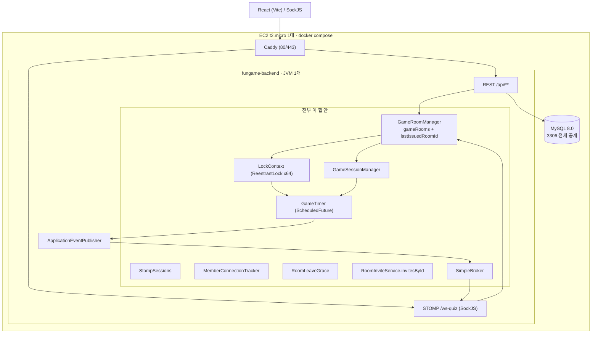
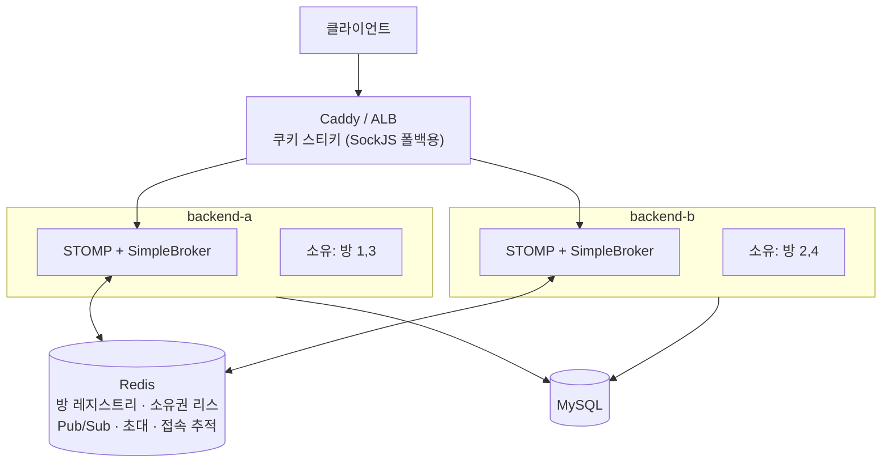

# 실행 계획: 인스턴스 2대 이상으로 트래픽을 나눠 받는다

작성일: 2026-09-28
대상: `backend` 전체 + 배포 인프라
선행 문서: [docs/design/20260808-backend-scalability-design.md](../../design/20260808-backend-scalability-design.md)
(설계 검토서다. 그 뒤로 SSE 가 STOMP 로 바뀌고 방 ID 발급이 DB 카운터에서 `AtomicLong` 으로 바뀌어
인벤토리가 어긋나 있다. **이 문서가 현재 코드 기준으로 다시 센 실행 계획이다.**)

---

## 0. 먼저 짚어둘 것 두 가지

### (a) "서버 1대" 전제를 담은 문서는 **정리했다 (2026-09-28)**

`backend/BACKEND.md` 6번은 원래 이랬다.

> **오버 엔지니어링 금지** : 현재 서버는 1대이며 scale out 할 생각이 전혀 없고 앞으로도 없으니까 오버 엔지니어링은 금지합니다.

이 문장을 남겨둔 채 코드를 바꾸면 이후 리뷰와 AI 에이전트가 계속 이걸 근거로 되돌리려 든다.
그래서 **코드에 손대기 전에** `BACKEND.md`·`LEGACY.md`·기존 설계 문서 세 개를 먼저 고쳤다. 상세는 §7.

### (b) EC2 프리티어에서 "2대"는 공짜가 아니다

| 항목 | 프리티어 | 2대로 갈 때 |
|---|---|---|
| EC2 t2/t3.micro | **계정당 월 750시간** | 2대 = 1,440시간 → **절반이 과금**. 대략 월 $8–9 |
| ALB | 12개월 750시간 + 15 LCU | 12개월 지나면 월 $16~ |
| ElastiCache micro | 12개월 750시간 | 기간 지나면 과금 |
| EBS 30GB | 계정 총합 | 2대로 나눠 써야 함 |

게다가 지금 t2.micro 한 대(RAM 1GB)에 **Caddy + 백엔드 + MySQL 이 전부 올라가 있다**(`compose.yml`).
여기에 인스턴스를 하나 더 붙이려면 MySQL 부터 떼내야 하고, 그러면 사실상 EC2 3대가 된다.

→ **이 계획은 4단계(실제 EC2 증설)를 마지막에 두고, 0~3단계는 EC2 1대 위에서
백엔드 컨테이너 2개를 띄워 전부 검증할 수 있게 짰다.** 돈을 쓰지 않고 멀티 인스턴스 정합성을
다 잡은 다음, 지표가 한 대의 한계를 증명했을 때만 4단계로 간다.

---

## 1. 지금 구조



이미 잘 되어 있는 것 하나: **HTTP 세션이 `spring-session-jdbc` 로 DB 에 있다.**
확장에서 제일 먼저 걸리는 인증 세션 공유가 이미 해결돼 있다. 이건 건드리지 않는다.

---

## 2. 확장을 막는 지점 — 전수 인벤토리

### 2.1 인메모리 상태 (인스턴스 경계를 못 넘는다)

| # | 위치 | 2대에서 생기는 증상 |
|---|---|---|
| S1 | `GameRoomManager:27` `gameRooms` | A 가 만든 방이 B 의 `GET /api/game/rooms` 에 안 보인다. B 로 붙은 사람은 `GAME_ROOM_NOT_FOUND` |
| ~~S2~~ | ~~`GameRoomManager` `lastIssuedRoomId`~~ — **0단계 B5 에서 DB 카운터로 옮겨 해결** | **두 인스턴스가 똑같이 1번부터 발급한다.** 서로 다른 두 방이 같은 ID 를 갖는다. 재기동하면 0 으로 돌아가 같은 인스턴스 안에서도 ID 를 재사용한다 |
| S3 | `GameSessionManager:18` `manager` | 정답 채팅이 B 로 들어오면 `gameSession == null` → **아무 일도 없이 return**. 유저에겐 정답이 씹힌 것으로 보인다 |
| S4 | `LockContext` (ReentrantLock 64 스트라이프) | 같은 방의 join/leave/ready 가 A·B 에서 동시에 돌아 상호배제가 사라진다 |
| S5 | `GameTimer:20` `roomTasks` | 게임을 시작한 인스턴스만 라운드를 돌린다. 그 인스턴스가 죽으면 그 방은 영원히 멈춘다(복구 경로 없음) |
| S6 | `StompSessions:12` | `isConnected` 가 자기 인스턴스만 본다. B 에 붙어 있는 사람을 A 는 오프라인으로 본다 |
| S7 | `MemberConnectionTracker:28,29` | 접속자 목록이 인스턴스마다 다르다. 로비 접속자 목록이 절반만 보인다 |
| S8 | `RoomLeaveGrace:26` `pendingByMember` | A 에서 끊긴 사람이 B 로 재접속하면 A 의 유예가 취소되지 않아 **재접속 성공 15초 뒤 강제 퇴장** |
| S9 | `RoomInviteService:33` `invitesById` | A 에서 만든 초대를 B 가 받으면 `INVITE_NOT_FOUND` |
| S10 | `GameRank`, `SkipVotes`, `AbstractQuiz.isRoundProcessing`, `Song/CsQuiz.currentIdx`, `RoundClock` | 한 판의 소유 상태. **소유 인스턴스 안에 있으면 그대로 맞다.** 고칠 대상이 아니라 "한 곳에 묶여야 하는 이유" |

### 2.2 메시징

| # | 위치 | 증상 |
|---|---|---|
| M1 | `WebSocketConfig:49` `enableSimpleBroker` | A 가 `/topic/room/1` 로 보낸 걸 B 의 구독자가 **못 받는다.** 같은 방인데 화면이 따로 논다 |
| M2 | `ApplicationEventPublisher` 8종 이벤트 (`RoomChangedEvent`, `PlayerJoinEvent`, `MemberPresenceChangedEvent`, `RoomInviteCreatedEvent` …) | 프로세스 밖으로 안 나간다. M1 의 근본 원인 |
| M3 | `LobbyNotifyService:53` `/topic/lobby`, `:63` `/queue/presence`, `InviteNotifyService` `/queue/invite` | **방과 무관한 전역 채널.** 방 단위 라우팅으로는 절대 해결되지 않는다. 크로스 인스턴스 팬아웃이 반드시 필요한 지점 |
| M4 | `RoomSubscriptionAuthorization:33` | 비소유 인스턴스에서 `hasPlayer` 가 false → **구독을 조용히 버린다.** 클라이언트는 구독에 성공한 줄 안다 |
| M5 | `WebSocketConfig:44` `withSockJS()` | XHR 폴백은 한 연결의 여러 요청이 같은 인스턴스로 가야 한다. 스티키 없으면 폴백 자체가 실패 |

### 2.3 `@Scheduled` — 전 인스턴스에서 각각 돈다

| # | 위치 | 성질 | 처리 |
|---|---|---|---|
| J1 | `GameRoomManager:181` `cleanupIdleRooms` (60s) | 소유 방만 대상이어야 | 소유권 필터 추가 |
| J2 | `MemberConnectionTracker:66` `expireReconnectGrace` (1s) | 상태가 공유되면 전역 작업 | 상태 이관 후 리더 1대만 |
| J3 | `RoomInviteService:82` `purgeExpiredInvites` (30s) | 상태가 공유되면 전역 | Redis TTL 로 대체하면 스케줄 자체가 없어짐 |
| J4 | `LobbyNotifyService:46` `processPendingUpdate` (500ms) | **인스턴스 로컬** (자기 구독자에게만 보냄) | 그대로 둔다 |
| J5 | `SongScrapeScheduler:15` `fillPendingSongs` (60s) | **전역.** `findOldest(10)` 에 클레임이 없어 두 인스턴스가 같은 행을 동시에 긁는다 | 유튜브 호출 N배 + 중복 upsert. 리더 1대 또는 행 클레임 |
| J6 | `PasswordResetService:84` `deleteExpiredTokens` (daily) | 전역. 멱등 DELETE 라 무해하지만 중복 | 리더 1대 |

### 2.4 1대에서도 이미 틀린 것 (대수와 무관)

| # | 위치 | 문제 |
|---|---|---|
| B1 | `PlayerNumberWriter:18-21` | `findByName` → `increment()` 는 락 없는 read-modify-write. 동시 호출 시 lost update 로 **같은 번호가 두 번 발급된다.** `@Transactional` 만으로는 못 막는다(REPEATABLE READ 는 갱신 손실을 막지 않는다) |
| B2 | `AsyncConfig` | executor 미지정 → Boot 기본값(core 8, **큐 무제한**). 부하가 오면 예외 대신 브로드캐스트가 **조용히 지연**된다 |
| B3 | `AppConfig:20` 풀 10개 | 게임 타이머 + STOMP 하트비트(10s) + 퇴장 유예가 한 풀을 나눠 쓴다. 한 방의 `endRound` 가 느려지면 **다른 방의 라운드 전환이 밀린다** |
| B4 | `GameTimer.startAfter` 콜백 | try/catch 가 없다. 콜백에서 예외가 나면 그 방은 **다음 라운드로 영영 못 넘어간다.** 로그도 안 남는다 |
| B5 | `GameRoomManager:28` | 재기동하면 방 ID 가 1번부터 다시 나온다. 방 ID 를 캐시한 클라이언트가 엉뚱한 방에 붙는다 |

### 2.5 인프라

| # | 위치 | 문제 |
|---|---|---|
| I1 | `compose.yml` mysql `ports: 3306:3306` | **DB 가 인터넷에 열려 있다.** 보안 그룹이 유일한 방어선. 2대로 가면 어차피 손대야 하는 지점이니 이때 사설망으로 내린다 |
| I2 | `compose.yml` | Caddy·백엔드·MySQL 이 1GB 한 대에 동거. 백엔드 인스턴스를 늘릴 자리가 없다 |
| I3 | `deploy-backend.yml` | `docker compose up -d --no-deps backend`, `docker exec fungame-backend` — **컨테이너 하나를 전제**한다. 무중단 교체 개념도 없다 |
| I4 | Flyway | 두 인스턴스가 동시에 뜨면 마이그레이션이 경합한다. Flyway 가 `flyway_schema_history` 에 락을 잡아 대체로 안전하지만, **기동 순서를 명시**해야 한다 |
| I5 | `monitoring.yml` 8081 | Prometheus 스크랩 타깃이 인스턴스마다 따로 필요. `instance` 라벨로 구분해야 대시보드가 의미를 갖는다 |

---

## 3. 목표 아키텍처

### 3.1 선택: 방 소유권 + Redis Pub/Sub 브로커 브리지



**세 가지 결정으로 이루어진다.**

**(1) 한 판의 권위 상태는 소유 인스턴스의 힙에 남긴다.**
`GameSession` 은 라운드마다 여러 번 변형되고 채팅 정답은 그보다 잦다. 이걸 Redis 에 올려
매번 직렬화하면 왕복 지연과 낙관적 락 재시도가 게임 체감을 망친다. 실시간 게임 서버가
관례적으로 방 단위 소유권을 쓰는 이유다. 소유 인스턴스 안에서는 **지금 코드가 그대로 맞다** —
`ConcurrentHashMap`, `ReentrantLock`, 로컬 `GameTimer` 전부 유효하다.

**(2) 팬아웃은 Redis Pub/Sub 이 `SimpleBroker` 사이를 잇는다.**
각 인스턴스가 Redis 채널을 구독하고, 받은 메시지를 자기 로컬 `SimpleBroker` 로 다시 흘린다.
`/topic/room/{id}` 뿐 아니라 **`/topic/lobby`·`/queue/presence`·`/queue/invite` 까지 한 번에 해결된다**(M3).
외부 STOMP 브로커(RabbitMQ)를 세우지 않아도 되고, 메시지 경로가 코드 안에 남아 디버깅이 쉽다.

**(3) 명령은 소유자에게 전달한다.**
비소유 인스턴스가 방 명령(정답 제출, ready, 설정 변경)을 받으면 소유자 인스턴스로 전달한다.
사설 IP 로 내부 HTTP 호출이 가장 단순하다. **절대 하지 말아야 할 것은 지금처럼 조용히 무시하는 것**
(S3, M4) 이다.

### 3.2 기각한 대안

| 대안 | 기각 이유 |
|---|---|
| **경로 라우팅** (`/ws-quiz/{roomId}` 로 게이트웨이가 방 단위 라우팅) | 로비에 있는 사람은 roomId 가 없어서 라우팅 키가 없다. 방에 들어갈 때마다 **WS 를 끊고 다시 붙어야 한다**(프런트 대공사). 게다가 로비·접속자·초대는 전역 채널이라 어차피 Pub/Sub 이 필요하다. 라우팅을 넣어도 Pub/Sub 을 못 뺀다 |
| **전면 공유 상태** (Redis + Redisson 락 + RabbitMQ 릴레이) | 게임 도메인 전면 재작성. `GameSession` 은 `Quiz` 객체 그래프를 직접 변형해 직렬화 경계가 없다. `startProcessing()` 의 라운드 중복 종료 방지도 분산 CAS 로 바꿔야 한다. 이 서비스는 방 수명이 짧아(유휴 30분 정리, 한 판 수 분) **인스턴스 장애로 진행 중 한 판을 잃는 비용이 낮다.** 비용이 이득을 넘는다 |
| **DB 로 전부 대체** (Redis 없이) | 1초 단위 접속 추적(J2)과 500ms 로비 팬아웃(J4)을 DB 폴링으로 하면 커넥션이 녹는다 |

### 3.3 감수하는 것

- 소유 인스턴스가 죽으면 **그 방의 진행 중 게임은 유실된다.** 리스 만료 후 다른 인스턴스가 인수해
  로비 목록에서 방을 지우고, 유저에게 명확히 안내한다. "라운드 중간 정밀 복구"는 비용 대비 가치가 없다.
- 배포할 때 드레인이 필요하다(§6).

---

## 4. 단계별 실행 계획

각 단계는 **독립적으로 가치가 있고**, 다음 단계로 안 넘어가도 손해가 없다.

### 0단계 — 1대에서도 틀린 것부터 고친다

확장과 무관하게 지금 버그다. 여기서 멈춰도 이득이다.

- [x] **B4** `GameTimer.startAfter` 가 넘겨받은 `Runnable` 을 try/catch 로 감싸 방 번호와 함께 로깅한다.
      게임 결과 브로드캐스트가 터져도 방이 `PLAYING` 으로 굳지 않게 `try/finally` 로 정리를 보장한다.
      행맨도 같은 구멍이 있어 함께 고쳤다. (#71)
- [x] **B3** 스케줄러 풀 분리. `@GameTaskScheduler`(게임 라운드 전용, 기본 8) 와
      `@AppTaskScheduler`(STOMP 하트비트 · 퇴장 유예 · **모든 `@Scheduled`**, 기본 5) 로 나눴다.
      **공유자가 셋이 아니라 넷이었다** — `TaskScheduler` 빈이 여럿이라 `@Scheduled` 가 이름으로
      `taskScheduler` 를 찾아 쓰고 있었고, 거기엔 유튜브를 긁는 `SongScrapeScheduler` 도 있다.
      그래서 `@Scheduled` 를 게임 쪽이 아니라 앱 쪽에 남겼다. 스레드 이름(`game-timer-`, `app-sched-`)으로
      어느 풀인지 구분된다.
- [x] **B2** `@Async` executor 에 상한을 둔다.
      **확인 결과**: 스케줄러 풀과 섞이지 않는다. 부트가 `applicationTaskExecutor` 를 만들고
      (우리 스케줄러 빈의 *선언 타입*이 `TaskScheduler` 라 `@ConditionalOnMissingBean(Executor.class)` 에
      걸리지 않는다) `@Async` 가 그걸 쓴다. 다만 **큐가 `Integer.MAX_VALUE`** 라 부하가 와도 예외 대신
      조용히 밀리기만 했다. 큐가 무한하면 스레드도 core 위로 안 늘어난다.
      `spring.task.execution.*` 으로 core 4 · max 8 · queue 1000 으로 묶고, 거부 정책을
      `CallerRunsPolicy` 로 뒀다 — 방송을 버리면 클라이언트가 이벤트를 영영 못 받으므로,
      버리는 대신 발행 스레드를 느리게 한다.
      **함정 하나**: `TaskExecutor` 타입 빈이 셋이라 타입 조회가 실패하고 `@Async` 는 부트가 달아둔
      `taskExecutor` **별칭**으로만 executor 를 찾는다. executor 빈을 직접 정의해 별칭이 사라지면
      스레드를 요청마다 새로 만드는 `SimpleAsyncTaskExecutor` 로 조용히 폴백한다.
- [x] **B5** 방 번호를 재기동에도 이어지게. **계획에 적었던 "기동 시 현재 최대 ID + 1 로 시드" 는
      성립하지 않았다** — 방이 전부 메모리에 있어 재기동하면 셀 대상이 없다. DB 카운터(`GAME_ROOM_COUNTER`)로
      옮겼다. 원자적 `UPDATE ... count = count + 1` 이라 lost update 도 없다.
      **덤으로 S2(2대가 나란히 1번 발급)도 함께 닫힌다** — DB 카운터는 인스턴스 수와 무관하다.
      3단계의 Redis `INCR` 은 필수가 아니라 선택이 됐다.
- [x] ~~**B1** `PlayerNumberWriter.issueNext` 를 원자적으로~~ → **지웠다.**
      유일한 호출자인 `POST /game/player` 를 프런트에서 아무도 부르지 않는 죽은 엔드포인트였다.
      `PlayerController` · `PlayerService` · `PlayerNumberWriter` 와 `PLAYER_COUNTER` 행을 지웠다.
      `counter_entity` 테이블은 방 번호 채번(B5)이 쓰므로 남긴다.

**종료 조건**: 활성 방 20개에서 라운드 전환 지연 p99 < 200ms. 한 방의 라운드 종료를 인위적으로
지연시켜도 다른 방의 전환과 STOMP 하트비트가 밀리지 않는다.

### 1단계 — 측정한다

**한 대의 한계를 숫자로 모르면 2대가 필요한지도 알 수 없다.** 이미 Actuator + Prometheus 가
`support:monitoring` 에 붙어 있으니 지표만 추가한다.

- [x] 커스텀 게이지: `fungame_rooms_active` · `fungame_games_in_progress` · `fungame_room_players` ·
      `fungame_stomp_sessions` · `fungame_members_online`
- [x] 타이머: `fungame_game_timer_lateness`(예약 시각보다 늦게 시작한 정도) ·
      `fungame_game_timer_task`(작업이 도는 데 걸린 시간). 앞엣것이 게임 풀 포화의 직접 지표다
- [x] `@Async` executor 큐 · 게임 스케줄러 풀 — `executor_*` 로 나온다.
      **부트가 `applicationTaskExecutor` 를 `@Lazy` 로 만들어 지표가 아예 없었다.**
      그 빈을 우리가 갖는 것으로 바꿔 기동과 함께 만들어지게 했다. 스케줄러는 부트가 빈 이름으로
      이미 붙이고 있어 따로 등록하지 않는다
- [ ] 그라파나 대시보드 — `infra/grafana/provisioning/dashboards/json-metrics/` 에 넣으면 CD 로 흐른다.
      JVM 힙 · 스레드 · GC 는 Micrometer 가 이미 내보내므로 패널만 만들면 된다

**종료 조건**: "인스턴스 1대의 한계는 동시 방 N개 / 동접 M명"이라고 근거를 대고 답할 수 있다.

### 2단계 — 상태를 인터페이스 뒤로 숨긴다 (동작 변화 0)

구현은 지금 그대로 두고 경계선만 긋는다. 리스크가 거의 없고 3단계 비용을 크게 줄인다.

- [ ] `RoomRegistry` 인터페이스 + `LocalRoomRegistry`(현 `ConcurrentHashMap`).
      **로비 목록용 `RoomSummary`(제목·인원·상태·게임타입)와 진행용 `GameRoom` 을 분리**하는 게 핵심이다.
      전자만 공유하면 되고 후자는 소유 인스턴스에 남는다. `RoomInfo.from(...)` 이 이미 그 요약을 만들고 있다.
- [ ] `RoomIdGenerator` 인터페이스 + `LocalRoomIdGenerator`(현 `AtomicLong`)
- [ ] `RoomLock` 인터페이스 + `LocalRoomLock`(현 `LockContext`). 시그니처 `withLock(roomId, supplier)` 는 이미 좋다
- [ ] `PresenceStore` 인터페이스 — `StompSessions` + `MemberConnectionTracker` 를 합쳐 하나의 포트로
- [ ] `InviteStore` 인터페이스 + `LocalInviteStore`(현 `invitesById`)
- [ ] `DomainEventBroadcaster` 인터페이스 + `LocalBroadcaster`(현 `ApplicationEventPublisher`)
- [ ] `@Scheduled` 6곳에 **"인스턴스 로컬 / 전역"** 을 주석과 이름으로 명시한다. 이 한 줄이 3단계에서 큰 차이를 만든다
- [ ] 각 인터페이스에 **계약 테스트**를 쓴다. 3단계에서 Redis 구현이 같은 테스트를 통과하면 교체가 안전하다

**종료 조건**: 기존 테스트 전부 통과. 런타임 동작 변화 0. 배포해도 아무도 눈치채지 못한다.

### 3단계 — 멀티 인스턴스 정합성 (EC2 1대 위에서, 컨테이너 2개로)

**여기서 돈을 쓰지 않는다.** 같은 EC2 에 `backend-a` · `backend-b` 두 컨테이너를 띄우고
Caddy 가 앞에서 나눈다. 프리티어 안에서 §2 의 모든 증상을 재현하고 잡는다.

- [ ] Redis 컨테이너 추가 (`compose.yml`). 일단 같은 호스트
- [ ] 인스턴스 식별자 도입 — `INSTANCE_ID` 환경변수, 모든 로그와 메트릭에 라벨로
- [ ] `RedisRoomIdGenerator` (`INCR room:seq`) — **S2 해결**
- [ ] `RedisRoomRegistry` (Hash + TTL) — `RoomSummary` 만 공유. **S1 해결**
- [ ] `RoomOwnership` — `SET room:{id}:owner {instanceId} NX EX 30` + 주기 갱신. 만료되면 인수 후 방 제거
- [ ] **명령 전달 경로** — 비소유 인스턴스가 방 명령을 받으면 소유자 사설 IP 로 전달.
      `GameServiceRouter` 앞에 한 겹. **S3 해결**
- [ ] `RedisBroadcaster` — 도메인 이벤트를 Redis Pub/Sub 으로. 각 인스턴스가 받아 로컬 `SimpleBroker` 에 흘린다.
      **M1·M2·M3 해결**
- [ ] `RedisPresenceStore` — 접속 세션과 유예를 Redis 로. **S6·S7·S8 해결**
- [ ] `RedisInviteStore` — Redis TTL 30초. **S9 해결, J3 스케줄 삭제**
- [ ] `RoomSubscriptionAuthorization` 이 공유 레지스트리를 보게. 거부할 때는 **조용히 버리지 말고**
      에러 프레임을 돌려준다. **M4 해결**
- [ ] `cleanupIdleRooms` 에 소유권 필터. **J1 해결**
- [ ] 전역 스케줄 작업(J2·J5·J6)에 ShedLock 또는 Redis 리더 선출.
      특히 **J5 는 유튜브 호출이 인스턴스 수만큼 늘어나 차단 위험**이라 우선순위가 높다
- [ ] Caddy 에 쿠키 기반 스티키(`lb_policy cookie`). SockJS XHR 폴백용. **M5 해결**
- [ ] `compose.yml` 을 인스턴스 2개 + Redis 로. MySQL 포트를 사설로 내린다. **I1 해결**
- [ ] Flyway 를 한 인스턴스만 돌리거나(`spring.flyway.enabled` 분기), 기동 순서를 `depends_on` 으로 명시. **I4 해결**
- [ ] Prometheus 스크랩 타깃을 인스턴스별로. **I5 해결**

**종료 조건**: 한 EC2 위 컨테이너 2개로,
A 에서 만든 방이 B 목록에 보이고 / B 로 들어온 정답이 처리되고 / A→B 재접속이 강제 퇴장당하지 않고 /
방 채팅이 양쪽 구독자에게 모두 도달한다. **소유 인스턴스를 `docker kill` 했을 때
그 방이 로비에서 사라지고 유저가 명확한 안내를 받는다.**

### 4단계 — 실제 EC2 증설 (1단계 지표가 한계를 증명했을 때만)

**진입 조건이 중요하다.** "곧 유저가 늘 것 같다"는 느낌은 진입 조건이 아니다.
그리고 **스케일아웃보다 먼저 시도할 것**: 인스턴스 스펙 상향(t2.micro → t3.small)과
0단계에서 나눈 스레드 풀 튜닝. 현재 첫 한계는 **1GB RAM 일 가능성이 가장 높고, 그건 설정이 아니라 돈**
이지만 서버를 늘리는 것보다는 훨씬 싸다.

구성 (§0-b 의 비용을 받아들인 뒤):

```
[Route53] → [ALB :443]
              ├─ (target group, 스티키 쿠키) → EC2-app-1 : backend
              └─ (target group, 스티키 쿠키) → EC2-app-2 : backend
                        ↓ 사설 서브넷
              [EC2-data] : MySQL + Redis   ← 또는 RDS + ElastiCache
```

- [ ] MySQL 을 앱 호스트에서 분리 (전용 EC2 또는 RDS). **I2 해결**
- [ ] Redis 도 같은 데이터 호스트로 (또는 ElastiCache)
- [ ] TLS 종료를 Caddy → ALB 로 옮긴다. 앱 인스턴스는 평문 8080 만
- [ ] 보안 그룹: 8080·3306·6379 는 **ALB / 앱 SG 에서만** 인바운드 허용
- [ ] ALB 에 스티키 세션(`lb_cookie`, duration = 세션 수명)
- [ ] 헬스체크 분리 — `/actuator/health/liveness`(JVM 생존) 와
      `/actuator/health/readiness`(신규 방을 받을 수 있는가). **합치면 드레인 중 인스턴스가 재시작돼
      진행 중 게임이 죽는다**
- [ ] `deploy-backend.yml` 을 다중 호스트로. **I3 해결** — §6

**더 싼 선택지 두 개** (ALB 비용을 피하고 싶다면):
- EC2-app-1 의 Caddy 가 자기 자신과 EC2-app-2 로 나눈다. 공짜지만 **app-1 이 단일 장애점**이다
- Cloudflare 무료 플랜을 앞에 두고 오리진 2개. 스티키는 Cloudflare 유료 기능이라 **SockJS 폴백을 끄고
  WebSocket 만 쓰도록 프런트를 고정해야 한다**(브라우저 지원율을 보면 실현 가능한 선택이다)

---

## 5. 파일별 착수 지도

| 파일 | 0단계 | 2단계 | 3단계 |
|---|---|---|---|
| `domain/room/GameRoomManager.java` | B5 | `RoomRegistry`·`RoomIdGenerator` 추출 | Redis 구현, 소유권 필터 |
| `domain/room/LockContext.java` | — | `RoomLock` 인터페이스 | 소유권이 상호배제를 대신하므로 **분산 락은 불필요.** 방 생성·인수만 Redis 락 |
| `domain/room/PlayerNumberWriter.java` | **B1** | — | — |
| `domain/session/GameSessionManager.java` | — | — | 명령 전달 경로 |
| `domain/session/GameTimer.java` | **B4** | — | 소유 방만 |
| `support/config/AppConfig.java` | **B3** | — | — |
| `controller/config/AsyncConfig.java` | **B2** | — | — |
| `controller/config/WebSocketConfig.java` | — | — | Pub/Sub 브리지, 스티키 전제 |
| `controller/websocket/StompSessions.java` | — | `PresenceStore` | Redis |
| `controller/websocket/RoomLeaveGrace.java` | — | `PresenceStore` | Redis |
| `controller/websocket/RoomSubscriptionAuthorization.java` | — | — | **M4** 에러 프레임 |
| `controller/websocket/LobbyNotifyService.java` | — | `DomainEventBroadcaster` | J4 는 로컬 유지 |
| `domain/member/MemberConnectionTracker.java` | — | `PresenceStore` | Redis, J2 리더 |
| `domain/invite/RoomInviteService.java` | — | `InviteStore` | Redis TTL, J3 삭제 |
| `domain/quiz/SongScrapeScheduler.java` | — | "전역" 명시 | **J5 리더 선출** |
| `domain/member/PasswordResetService.java` | — | "전역" 명시 | J6 리더 |
| `compose.yml` | — | — | 인스턴스 2 + Redis, **I1** |
| `.github/workflows/deploy-backend.yml` | — | — | **I3** 다중 호스트 |
| `backend/BACKEND.md` | **§7** | — | — |

---

## 6. 배포와 드레인 (3단계 이후)

지금 배포 스크립트는 컨테이너 하나를 세우고 다시 띄운다. 2개가 되면 **한 번에 하나씩** 교체한다.

1. 대상 인스턴스를 "신규 방 배정 제외"로 표시 (Redis 플래그 → readiness false)
2. 소유한 방이 자연 종료되기를 기다린다 (한 판 ≈ 수 분). 상한 타임아웃을 둔다
3. 남은 방에 종료 예고를 브로드캐스트하고 정리
4. 컨테이너 교체 → healthy 확인 → 배정 재개
5. 다음 인스턴스로

지금 스크립트의 좋은 점(이전 이미지 롤백, `.env` 고정)은 그대로 살리고 호스트 루프만 두른다.
`docker exec fungame-backend` 처럼 **이름이 하나로 박힌 곳**이 교체 대상이다.

---

## 7. 문서 정리 — **완료 (2026-09-28)**

코드에 손대기 전에 "서버는 1대"를 전제한 문서부터 고쳤다. 규칙을 지우는 게 아니라
**판단 기준을 남기는 것**이 요점이었다.

- [x] `backend/BACKEND.md` 6번 — "오버 엔지니어링 금지 / scale out 할 생각 없음" 을
      **"근거 없는 일반화 금지 — 확장은 지표가 한계를 보일 때, 이 계획의 단계를 따라"** 로 교체.
      **7번 "인스턴스는 여러 대가 될 수 있다"** 를 새로 추가했다. 새 상태를 만들 때
      인스턴스 로컬이어도 되는지 먼저 판단하고, `@Scheduled` 에는 로컬/전역을 주석으로 남긴다는 규칙이다.
- [x] `backend/docs/LEGACY.md` §4 — 제목이 "단일 서버 환경의 동시성 제어 전략 부재" 였고
      **"Redis 같은 분산 락은 오버엔지니어링이니 지양"** 이라고 못박고 있었다.
      현재 구조(스트라이프 락 · SimpleBroker · 인메모리 맵)와 2대에서 깨지는 방식을 적고,
      **소유 인스턴스 안에서는 `ReentrantLock` 이 여전히 맞다**는 구분을 남겼다.
- [x] `docs/design/20260808-backend-scalability-design.md` — 배경 자료로 강등.
      전제가 바뀌었다는 것과, 그 사이 코드가 바뀌어 **낡은 부분**(SSE 전부 삭제됨,
      roomId 는 DB 카운터가 아니라 `AtomicLong`, 파일 경로가 패키지 재편 이전, 유예 5초→15초,
      1초 tick 없어짐)을 문서 머리에 명시했다. 여전히 유효한 §3·§4·§7·§8 도 같이 표시했다.

남은 문서 정리 (각 단계에서 함께):
- [ ] `backend/BACKEND.md` 기술 스택의 `**데이터베이스:** (현재 설정된 DB 확인 필요)` → MySQL 8.0 / 로컬 H2.
      스케일아웃과 무관한 방치된 플레이스홀더다
- [ ] `README.md` — 3단계에서 로컬 멀티 인스턴스 기동 방법을 추가한다
- [ ] `backend/ARCHITECTURE.md` — 3단계에서 Redis 포트를 어느 모듈에 둘지 결정하고 모듈 의존 그래프를 갱신한다
      (`storage:redis-core` 를 새로 두는 쪽이 현재 `storage:db-core` 와 대칭이다)

---

## 8. 하지 않을 것

| 항목 | 이유 |
|---|---|
| 마이크로서비스 분해 | 도메인이 작고 팀이 작다. 모듈 경계는 지금 gradle 멀티모듈로 충분하다 |
| Kafka / 이벤트 소싱 | 방 수명이 짧아 이벤트 재생 가치가 없다 |
| CQRS + 별도 읽기 모델 | 로비 목록은 방 몇 개 순회로 끝난다 |
| `GameSession` 전면 Redis 이관 | §3.2 |
| STOMP 외부 브로커(RabbitMQ) | Pub/Sub 브리지로 충분하다. 운영할 컴포넌트를 하나 덜 늘린다 |
| Kubernetes | EC2 3대에 k8s 를 올리면 관리 비용이 앱을 넘는다. compose + systemd 로 충분하다 |
| 멀티 리전 | 대상 사용자가 국내다 |
| 세션을 Redis 로 이관 | `spring-session-jdbc` 가 이미 공유되고 동작한다. 트래픽이 DB 를 압박한다고 **측정된 뒤에** 옮긴다 |

---

## 9. 검증 전략

`BACKEND.md` 의 TDD 원칙에 맞춰 단계별로.

**0단계**
- B1: 동시 `issueNext` N개 후 반환값 유일성 단정. **실 DB 통합 테스트여야 한다** — lost update 는
  DB 격리 수준에서 생기므로 스텁으로는 재현되지 않는다
  (※ 이 PC 는 Docker Engine 29 와 testcontainers 가 안 맞아 통합 테스트가 안 돈다. CI 에서 확인한다)
- B3: 한 방의 `endRound` 를 인위적으로 지연시키고 다른 방의 라운드 전환 간격을 `awaitility` 로 측정
- B4: 콜백에서 예외를 던지는 방을 만들고, 로그가 남고 **다른 방은 멀쩡한지** 확인

**2단계**
- 각 포트에 계약 테스트. `Local*` 구현이 통과하는 그 테스트를 3단계의 `Redis*` 구현이 그대로 통과해야 한다.
  이게 교체의 안전망이다

**3단계** — 인수 시나리오 (컨테이너 2개, Testcontainers Redis)
- A 에서 만든 방이 B 의 목록에 보인다
- B 로 들어온 정답이 처리되고 두 인스턴스의 구독자 모두 `ROUND_END` 를 받는다
- A 에서 끊고 B 로 재접속 → 15초 뒤 강제 퇴장당하지 **않는다**
- A 에서 만든 초대를 B 의 대상자가 받는다
- A 와 B 가 동시에 방을 만들어도 ID 가 겹치지 않는다
- **소유자 강제 종료** → 방이 로비에서 사라지고, 남은 유저가 조용한 멈춤이 아니라 명확한 안내를 받는다
- 비소유 인스턴스의 잘못된 구독이 **조용히 버려지지 않고** 에러로 돌아온다

---

## 10. 요약

- 지금 코드는 1대 전제로 **일관되게** 쓰여 있다. 인메모리 맵 + JVM 락 + SimpleBroker 는 1대에서
  가장 빠르고 단순한 선택이고, 잘못 쓴 게 아니다.
- 확장을 막는 지점은 **상태 10 · 메시징 5 · 스케줄 6 · 인프라 5 = 26곳**이고,
  그중 진짜 어려운 건 브로커(M1·M3)와 게임 세션 소유(S3·S5)다.
- **B1·B2·B3·B4·B5 는 서버 대수와 무관하게 지금 버그다.** 확장을 안 하기로 해도 고칠 값어치가 있다.
- 목표는 **방 소유권 + Redis Pub/Sub 브리지**. 게임 도메인 코드를 보존하면서 확장하는 경로다.
- **3단계까지는 EC2 1대 위 컨테이너 2개로 전부 검증한다. 돈은 4단계에서만 쓴다.**
- 4단계 진입 조건은 1단계 지표뿐이다. 그 전에 스펙 상향과 스레드 풀 튜닝을 먼저 시도한다.
